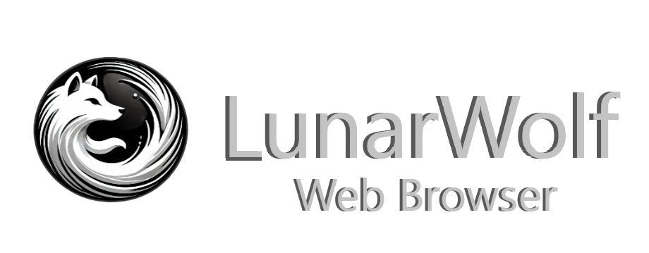

LunarWolf Browser is a custom Electron-based web browser designed with a modular UI, and browser approach, It features a custom-built tab system and browser container.

## Features
- **Multi-tab browsing** with a custom tab management system
- **Electron-based rendering**
- **Minimalist and user-friendly UI**
- **Customizable browsing experience**

> NOTE; the current state of webview confuses me, but its still being activly support its just undergoing a arc change, so this browser is decently stable with it as of my testing, if anyone has an alternete solution to rework the browing engine backend please commit some changes through a pull request.

+ if you want to know more about webview, read electrons official doc regarding it: https://www.electronjs.org/docs/latest/api/webview-tag

> ANOTHER THING TO NOTE: this project is in very early stages, which means its marked unstable untill prior notice.

## instructions
1. Clone the repository:
   ```sh
   git clone https://github.com/LunarWolf-Browser-Projects/LunarWolf-Browser-Desktop.git
   ```
2. Install dependencies:
   ```sh
   yarn install
   ```
3. build the application:
   ```sh
   yarn run build
   ```
4. Run the application:
   ```sh
   yarn run start.
   ```

## Contributing
Contributions are welcome!

## License
This project is licensed under `MIT` See the `LICENSE` file for details.

## Acknowledgments
- some of the code within this project was from another project, for those peices of code all credit goes to them and there work, theres some original stuff in here tho, you can see contributions to there work (they did not have no involvment with this project) i just used some of there code as a placeholder, which can be found in the `tabbar.ts` and `tabbarstyle.css` files located within the renderer.
